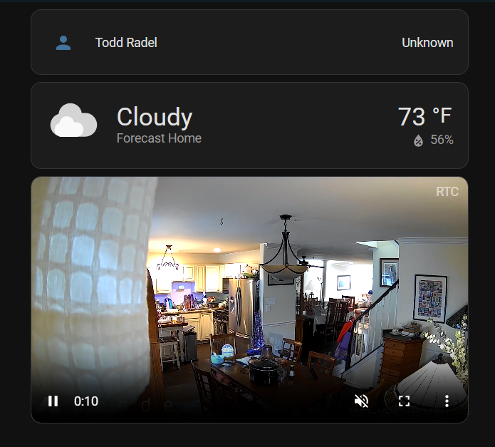
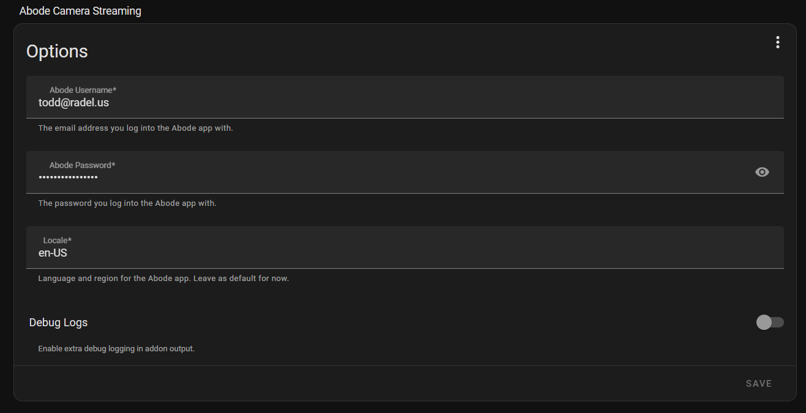

# Home Assistant Add-on: Abode Stream

_Provides streaming video from Abode security cameras._

![Supports aarch64 Architecture][aarch64-shield]
![Supports amd64 Architecture][amd64-shield]




## Introduction

This is an unofficial add-on for [Home Assistant][hass] that enables streaming
Live View from [Abode] security cameras. It is built on top of the excellent
[go2rtc] streamer by @AlexxIT.

**NOTE:** Abode has not published official APIs for their cameras. This add-on was
written by observing the Abode web app and reverse-engineering the API calls.
It may stop working if Abode changes their internal APIs.

As of version 1.2.0, KVS streams no longer time out. The add-on uses the [echo]
feature of go2rtc to generate stream URLs on demand rather than at startup.


## Installation

This add-on requires two other components: the [Abode integration][abode-int] and
WebRTC Camera.

### Prerequisites

1. Install [HACS] if you haven't already, then restart Home Assistant.
2. Add the [Abode integration][abode-int] and configure it. You should see entities
   for each of your cameras.
3. In HACS, install the **WebRTC Camera** component, then restart Home Assistant.
4. Go to **Settings** → **Devices & services** and add **WebRTC Camera**.
   When prompted for the go2rtc URL, enter `http://localhost:1984/`.

### Add the repository

Click the button below to add this repository to your Home Assistant:

[](https://my.home-assistant.io/redirect/supervisor_add_addon_repository/?repository_url=https%3A%2F%2Fgithub.com%2F40sixty%2Fha-addons)

Or add it manually:

1. Go to **Settings** → **Add-ons** → **Add-on Store**
2. Click the **⋮ menu** (top right) → **Repositories**
3. Add `https://github.com/40sixty/ha-addons` and click **Add**

Refresh your browser (F5), then find **Abode Stream** in the store and install it.


## Configuration

After installing, click the **Configuration** tab. The only required fields are
your Abode username (usually an email address) and password. Click **Save** when done.



| Option | Required | Description |
|--------|----------|-------------|
| `abode_username` | Yes | Your Abode account email |
| `abode_password` | Yes | Your Abode account password |
| `locale` | No | Locale string (default: `en-US`) |
| `debug` | No | Enable debug logging (default: `false`) |


## Adding cameras to a Lovelace dashboard

Edit your dashboard and add a card. Select **Custom: WebRTC Camera** and use the
YAML editor to paste:

```yaml
type: custom:webrtc-camera
streams:
  - type: webrtc
    url: kitchen_cam
```

Replace `kitchen_cam` with your camera's entity name. See the
[WebRTC Camera documentation][webrtc] for more options.


## How it works

Abode cameras don't support local streaming — they send video to
[Amazon Kinesis Video Streams][kvs]. When Live View starts, the Abode API returns
a KVS endpoint URL. This add-on fetches those URLs from the Abode API using your
credentials, generates a `go2rtc.yaml` configuration, and launches go2rtc to
handle the actual streaming.


## Supported hardware

| Architecture | Supported |
|---|---|
| amd64 | Yes |
| aarch64 | Yes |
| armv7 | No |
| armhf | No |
| i386 | No |

armv7, armhf, and i386 are not supported because [go2rtc] does not support them.


## Issues & support

[Open a GitHub issue][bug] and include the full add-on log if possible.


[aarch64-shield]: https://img.shields.io/badge/aarch64-yes-green.svg
[amd64-shield]: https://img.shields.io/badge/amd64-yes-green.svg
[abode]: https://goabode.com/
[hass]: https://www.home-assistant.io/
[hacs]: https://hacs.xyz/
[abode-int]: https://www.home-assistant.io/integrations/abode/
[go2rtc]: https://github.com/AlexxIT/go2rtc
[webrtc]: https://github.com/AlexxIT/WebRTC/blob/master/README.md#custom-card
[kvs]: https://aws.amazon.com/kinesis/video-streams/
[echo]: https://github.com/AlexxIT/go2rtc/wiki/Source-Echo-examples
[bug]: https://github.com/40sixty/ha-addons/issues/new
